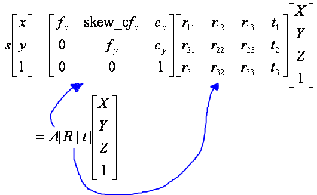
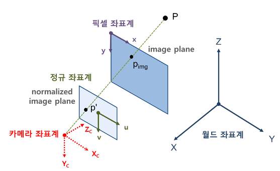

# Camera

## Camera Calibration

    실제 3차원을 카메라로 2차원 이미지로 만들어야 한다.
    
    3차원의 점을 카메라의 위치와 방향에따라 2차원으로 만들지 않고,
    실제 이미지는 사용된 렌즈, 렌즈와 이미지 센서와의 거리, 렌즈와 
    이미지 센서가 이루는 각 등 카메라 내부의 기구적인 부분에 의해서 크게 영향을 받는다.

    따라서, 3차원 점들이 영상에 투영된 위치를 구하거나 역으로 영상좌표로부터 3차원 공간좌표를 
    복원할 때에는 이러한 내부 요인을 제거해야만 정확한 계산이 가능해집니다. 
    그리고 이러한 내부 요인의 파라미터 값을 구하는 과정을 카메라 캘리브레이션이라 부른다.

### 1. 캘리브레이션 개요

- XYZ : 월드 좌표계 상의 3D 점의 좌표
- [R|t] 외부 파라미터(extrinsic parameter) : 월드 좌표계를 카메라 좌표계로 변환시키기 위한 회전/이동변환 행렬
- A 내부 파라미터(intrinsic parameter) : intrinsic camera matrix
- A와 [R|t] : camera matrix, projection matrix

### 2. 카메라 내부 파라미터

- 초점거리(focal length) : fx, fy
- 주점(principal point) : cx, cy
- 비대칭계수(skew coefficient) : skew_c = tana

#### 초점거리 (focal length)

- 카메라 모델에서 말하는 초점 거리는 렌즈 중심과 이미지센서(CCD, CMOS 등)와의 거리

ref - [LINK](https://darkpgmr.tistory.com/32)

