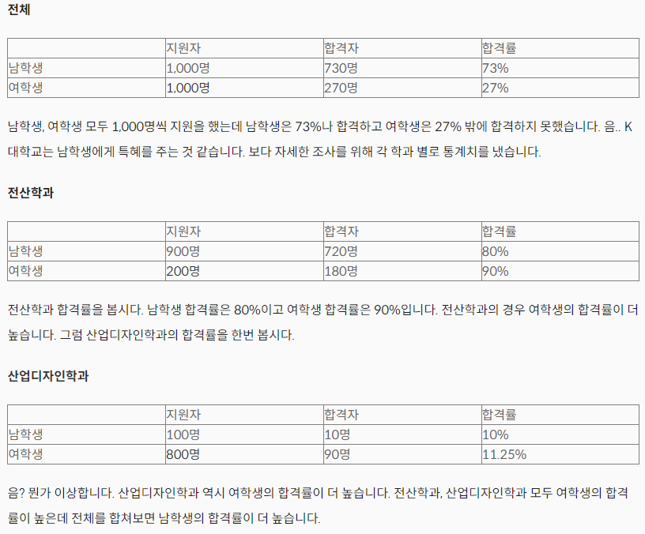
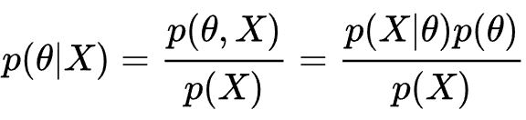
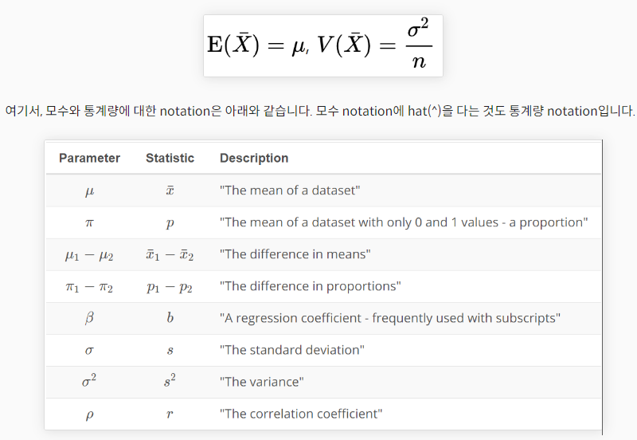

# Data Science

## Pandas

<details>
<summary>Click</summary>

#### 

```python
import pandas as pd

df = pd.read_csv("")

# Remove duplicated elements
df.duplicated().sum()

# Fix the typo
df.rename(columns={"Handcap": "Handicap"}, inplace=True)

# Change the data type
df.AppointmentDay = pd.to_datetime(df.AppointmentDay).dt.date
df.ScheduledDay = pd.to_datetime(df.ScheduledDay).dt.date

# 'No-show'를 'Show'로 바꾸겠습니다. 또한 Yes는 0, No는 1로 데이터
df.rename(columns={"No-show": "Show"}, inplace=True)
df.replace({'Show': {'No': 1, 'Yes': 0}}, inplace = True)

# Modify nonsense values -> 음수 불허
df[df['PeriodBetween'] < 0] = 0

# Segment PeriodBetween values into bins
bins = pd.IntervalIndex.from_tuples([(-1, 1), (1, 5), (5, 10), (10, 200)])
labels=["rightNow", "fewDaysAgo", "severalDaysAgo", "longAgo"]
df['PeriodBetween'] = pd.cut(df['PeriodBetween'], bins=bins, labels=labels)
```
</details>

## 데이터의 종류(양적 데이터, 질적 데이터)

<details>
<summary>Click</summary>

<table>

<tr>
    <td colspan="2">양적 데이터 (Quantitative, Numeric)<br>: 수학 연산을 할 수 있는 수치 값</td>
    <td colspan="2">질적 데이터 (Qualitative, Categorical)<br>:범주로 나누어지는 값</td>
</tr>

<tr>
    <td> 연속형 (Continuos) </td>
    <td>ex) 키, 나이, 수입</td>
    <td> 순서형 (Ordinal) </td>
    <td> Grade, 순위(랭킹) </td>
</tr>

<tr>
    <td> 이산형 (Discrete) </td>
    <td>ex) 사과의 갯수, 책의 페이지 수 </td>
    <td> 명목형 (Nominal) </td>
    <td> 성별, 뷔페의 음식 메뉴, 우편 번호 </td>
</tr>

</table>            

</details>

## 기술 통계학과 추측 통계학

<details>
<summary>Click</summary>

### 통계학의 구분

- 기술 통계학(Descriptive Statistics)과 추측 통계학(Inferential Statistics)으로 구분
- 기술 통계 : 현재 가지고 있는 데이터를 기반
- 추측 통계 : 현재 가지고 있는 데이터로부터 더 큰 집단의 특징을 추측(확률론)

### 기술 통계학

정량적(Quantative) 데이터를 기술하는 4가지 방법

- 대표값(Center) : 평균(Mean), 중앙값(Median), 최빈값(Mode)
- 흩어짐 정도(Spread) : 범위(Range), 사분위 간 범위(Interquatile Range, IQR), 분산(Variance), 표준편차(Standard Deviation)
- 분포 형태(Shape of distribution) : Symmetric (주로 정규분포), Right-skewed, Left-skewed
- 극단치(Outliers)

### 추측 통계학

- 모집단(Population) : 관심 있는 대상 모두의 수치적 자료
- 모수(Parameter) : 모집단의 특징을 나타내는 양적인 측도
- 표본(Sample): 모집단으로부터 뽑은 부분집합
- 통계량(Statisctic): 표본의 특성을 나타내는 양적인 측도
- 표본의 통계량 -> 모집단의 모수를 추론

</details>

## 분산과 표준편차에서 n이 아니라 n-1로 나누는 이유(자유도)

<details>
<summary>Click</summary>

### 자유도(Degree of freedom)

- 평균 = (x1 + x2 + x3 + ... + x(n-1) + x(n)) / n
- 마지막은 정해져있기 때문에 n-1로 나누어야 한다

### 분산과 표준편차를 구할 때 n이 아닌 n-1로 나누는 이유는?

- 표본 분산은 모 분산보다 작은 경향
- 모 분산보다 작아지려는 경향을 가진 표본 분산을 보존
- n으로 나눈 표본 분산보다 n-1로 나눈 표본 분산 값이 더 클 것

</details>

## 심슨의 역설

<details>
<summary>Click</summary>

### 심슨의 역설(Simpson's paradox)이란?

- 

</details>

## 베이즈 추정 : Bayesian Estimation

<details>
<summary>Click</summary>

### 베이즈 추정이란?

베이즈 추정 : 추론 대상의 사전 확률과 추가적인 정보를 기반으로 해당 대상의 사후 확률을 추론하는 통계적 방법

- 

</details>

## 표본 분포, 대수의 법칙, 중심극한정리

<details>
<summary>Click</summary>

### 확률 변수, 확률 분포, 확률 표본, 표본 분포

- 모집단(Population) : 전체 데이터
- 모수(Parameter) : 전체 데이터의 특성
- 표본(Sample) : 데이터의 일부
- 확률 변수(Random Variable) : 특정 확률로 발생하는 각각의 결과를 수치값으로 표현한 변수
- 확률 분포(Probability distribution) : 확률 변수 X의 모든 값과 그에 대응하는 확률
- 확률 표본(Random Sample) : 확률 변수 X에 대한 크기 n
- 표본 분포(Sampling distribution) : 통계량의 분포

- 

### 대수의 법칙(Law of Large Numbers)

대수의 법칙(큰 수의 법칙, 라플라스의 정리라고도 함)이란 표본의 수가 많을수록(즉, n이 클수록) 표본평균이 모평균에 가까워진다

### 중심극한의정리(Central Limit Theorem)

n이 클수록 확률 변수의 평균, proportion, 평균의 차이, proportion의 차이의 분포는 정규분포에 가까워진다는 이론

## 부트스트랩 : Bootstrap

### 부트스트랩(Bootstrap)

모수의 분포를 추정하는 방법 : 표본에서 추가적으로 표본을 복원 추출하고 각 표본에 대해 통계량을 다시 계산

### 신뢰구간

신뢰구간 : 모수가 어느 범위안에 있는지를 확률적으로 보여주는 방법

- 신뢰 구간 : 표본의 수가 많을 수록 작아진다
- 신뢰수준(95%, 99%)이 클수록 신뢰구간은 커진다.

</details>

## 가설검정과 p-value, 본페로니 교정

<details>
<summary>Click</summary>

### 가설 검정

가설검정(Test of hypotheses) : 자연법칙이나 사회현상에 대해 관찬 결과를 두 가지 가설로 세우고 뭐가 참인지 가려냄

### 귀무가설과 대립가설

- H1, 대립가설(Alternative Hypothesis) : 새로 제기되는 주장
- H0, 귀무가설(Null Hypothesis) : 지금까시 사실로 인식되어온 주장

- 채택(Accept) : 특정 가설이 참이라고 판정
- 기각(Reject) : 특정 가설을 거짓이라고 판정

### 제 1종 과오와 제 2종 과오

- 제 1종 과오(Type I Error) : H0가 참인데 이를 기각하는 과오
- 제 2종 과오(Type II Error) : H0가 거짓인데 이를 채택하는 과오

### p-value

- p-value ≤ α --> 귀무가설(H0) 기각
- p-value ＞α --> 귀무가설(H0) 채택


++++
++++

</details>


## 통계적 유의성의 함정

<details>
<summary>Click</summary>

- 표본의 크기가 크면 어떠한 가설이라도 통계적의로 유의하다고 결과가 나올 수 있음
- 하지만 통계적으로 유의하다고 실질적으로 유의한 것은 아님

</details>


## P-value의 함정

## A/B Test

<details>
<summary>Click</summary>

### A/B Test

A/B TEST는 마케팅이나 웹 페이지 개선에 많이 쓰이는 테스트 기법

- 귀무가설 : 새로운 웹페이지(실험군)가 기존 웹페이지(대조군)보다 효과가 덜 하거나 차이가 없다
- 대립가설 : 새로운 웹페이지가 더 효과적이다

### A/B Test를 왜 이런식으로 할까요?

- 다양한 변인, 나머지 조건을 모두 동일하게 고정하기 위해

### Change Aversion vs Novelty Effect

- 변화를 싫어하는 문제 = Chage Aversion
- 변화를 무작정 반기는 문제 = Novelty Effect

</details>


## reference

- https://bkshin.tistory.com/entry/DATA-6