# Machine Learning

## Naive Bayes Classification

Click

- 나이브 베이즈는 스팸 메일 필터, 텍스트 분류, 감정 분석, 추천 시스템 등에 광범위하게 활용되는 분류 기법
- feature끼리 서로 독립이라는 조건이 필요
- [ref](https://bkshin.tistory.com/entry/%EB%A8%B8%EC%8B%A0%EB%9F%AC%EB%8B%9D-1%EB%82%98%EC%9D%B4%EB%B8%8C-%EB%B2%A0%EC%9D%B4%EC%A6%88-%EB%B6%84%EB%A5%98-Naive-Bayes-Classification)

## SVM, Support Vector Machine

Click

- 경계선(Decision Boudary) : Margin을 최대화하는 선을 생성 
- Robustness : outlier의 영향을 받지 않는다.

### Kernel Trick

- Kernel Trick : 저차원 공간(low dimensional Space)을 고차원 공간(High dimensional Space)으로 매핑해주는 작업
- 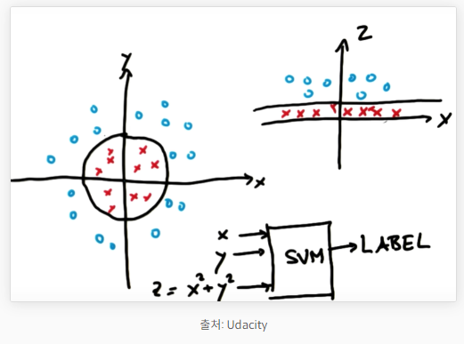

### Kernel, C, Gamma

- Kernel : decision boundary 모양 (linear, poly, sigmid, rbf)
- C : 크면 overfitting(굴곡), 낮으면 underfitting(직선)
- Gamma : Defines how far the influence of a single training point reaches 
  - Gamma 작으면 reach가 멀다, Gamma 높으면 reach가 가깝다
  - Gamma 크다 -> reach 가깝다 -> 멀리있는 것 영향 X -> 굴곡
  - Gamma 작다 -> reach 멀다 -> 대부분 영향 -> 잘 안구부러 짐

## 결정 트리, Decision Tree

Click

- 분류, 회귀 모두 가능
- 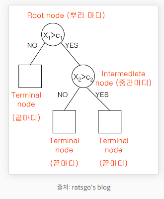
- 지나치게 많이 하면 오버피팅이 된다

### 가지치기, Pruning

- 오버피팅을 막기 위한 전략
- min_sample_split : 한 노드에 들어있는 최소 데이터 수

### 알고리즘 : 엔트로피(Entropy), 불순도(Impurity)

- 불순도 : 해당 범주 안에 서로 다른 데이터가 얼마나 섞여 있는지
- 엔트로피 : 불순도를 수치적으로 나타낸 척도. 
- 엔트로피가 1이면 불순도가 최대(WORST), 엔트로피가 0이면 불순도는 최소(BEST)

- 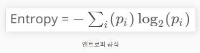

### 정보 획득(Information gain)

- 엔트로피가 1인 상태에서 0.7인 상태로 바뀌었다면 정보 획득(information gain)은 0.3
- Information gain = entropy(parent) - [weighted average]entropy(children)
- 결정 트리 알고리즘은 정보 획득을 최대화하는 방향으로 학습이 진행됩니다. 

## 랜덤 포레스트, Random Forest

Click

- 결정 트리(Decision Tree)가 모여 랜덤 포레스트(Random Forest)를 구성
- 결정 트리 하나만으로도 머신러닝을 할 수 있습니다. 하지만 결정 트리의 단점은 훈련 데이터에 오버피팅이 되는 경향
  - 여러 개의 결정 트리를 통해 랜덤 포레스트를 만들면 오버피팅 되는 단점을 해결
- 앙상블(Ensemble) : 결정트리의 Ensemble
- n_estimators: 랜덤 포레스트 안의 결정 트리 갯수
- max_features: 무작위로 선택할 Feature의 개수

## K-최근접 이웃 : K-Nearest Neighbor, KNN

Click

- 새로운 데이터가 주어졌을 때, K개를 보고 제일 많은 Class로 분류
- KNN의 특징은 훈련이 따로 필요 없다 -> real-time 예측, SVM이나 선형 회귀보다 빠름
- 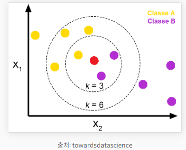

### 거리 계산

1. 유클리드 거리(Euclidean Distance)
- 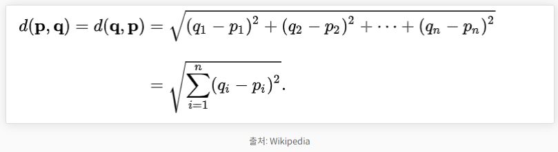

2. 맨해튼 거리(Manhattan Distance)
- 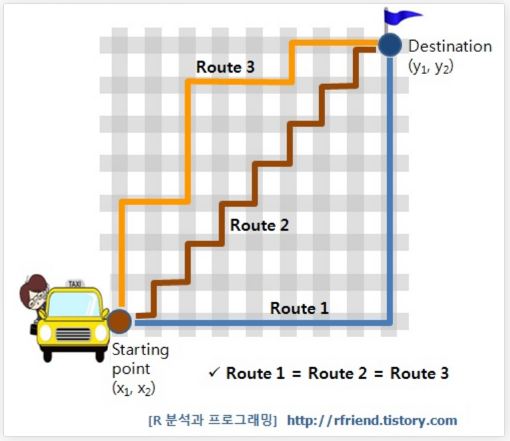

## K-평균 클러스터링 : K-means Clustering

Click

- 클러스터(Cluster) : 클러스터란 비슷한 특성을 가진 데이터끼리의 묶음
- 클러스터링이란 어떤 데이터들이 주어졌을 때, 그 데이터들을 클러스터로 그루핑 시켜주는 것

- 프로세스 
  - K 결정
  - 초기 Centorid 선택
    - random
    - 수동으로 설정
    - Kmean++ 방법
  - 모든 데이터를 순회하여 각 데이터마다 가장 가까운 Centroid가 속해있는 클러스터로 assign
  - centroid를 클러스터의 중심으로 이동
  - 데이터 순회 -> centroid 이동 반복
- 단점 : local minimum

## Feature Scaling & Feature Selection

Click

### Feature Scaling

- Feature들의 크기, 범위를 정규화시켜주는 것을 말합니다.
- 정규화 VS 표준화 -> 모두 시각화 해보고 결정해야한다.

1. Min-Max Normalization(정규화)
- 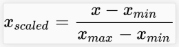

2. Standardization(표준화)
- 정규분포 만들기
- 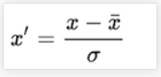

3. Log을 이용하여 정규분포
- Skewness(왜도, 비대칭도)
- Kurtosis(첨도, 뾰족한 정도)
- Log를 취해주게 되면 큰 숫자를 같은 비율의 작은 숫자로 만들어, 첨도와 왜도가 줄어들면서 정규성이 높아진다.

### Feature Selection

- 너무 적은 feature를 선택하면 oversimplified 
- 너무 많은 feature를 선택하면 overfitting
- Lasso (Least Absolute Shrinkage and Selection)는 extra feature에 penalty를 주는 방법
- minize SSE + λ |β| 

## 차원 축소와 PCA(Principal Components Analysis)

Click

- 차원 축소 이유 : Feature가 많아질수록 예측 신뢰도가 떨어지고, Overfitting이 발생

### 차원 축소를 하는 이유

1. 시각화(visualization)
- 시각화를 통해 데이터 패턴을 쉽게 인지

2. 노이즈 제거(Reduce Noise)
- 쓸모없는 Feature를 제거함으로써 노이즈를 제거

3. 메모리 절약(Preserve useful info in low memory)
- 쓸모없는 Feature를 제거함으로써 메모리 절약

4. 퍼포먼스 향상
- 불필요한 Feature들을 제거해 모델 성능 향상에 기여

### PCA 프로세스

1. 데이터 중심 정하기
2. 데이터의 중심을 원점(0,0)으로 이동하기
3. 원점을 지나는 직선 그리기(Random하게)
4. 주어진 데이터에 가장 fit하도록 원점을 지나는 직선을 회전
5. 직선에 수직이 되게 사상(Projection)
6. 스케일링을 통해 EigenVector 만들기

 - [ref](https://bkshin.tistory.com/entry/%EB%A8%B8%EC%8B%A0%EB%9F%AC%EB%8B%9D-9-PCA-Principal-Components-Analysis)

## 교차 검증(Cross Validation)과 혼동행렬(Confusion Matrix)

Click

- 교차검증은 모델을 평가하는 방법 중 하나
### K-fold 교차검증 : K-fold Cross Validation

1. 데이터를 K개로 쪼갠다.
2. 하나는 검증 데이터, 나머지는 훈련 데이터로 사용해 성능을 구한다.
3. 또 다른 부분을 검증 데이터, 나머지를 훈련 데이터로 사용해 성능을 구한다.
4. K번 반복한다.
5. K번의 성능의 평균을 구한다.

단점 : 시간과 메모리

### Stratified K-fold Cross Validation

- Label이 극히 적을 때, TrainSet에 Target이 없는 경우를 방지하여 균일하게 나누는 방식

### Confusion Matrix

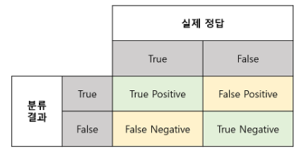

    True Positive(TP) : 실제 True인 정답을 True라고 예측 (정답)
    False Positive(FP) : 실제 False인 정답을 True라고 예측 (오답)
    False Negative(FN) : 실제 True인 정답을 False라고 예측 (오답)
    True Negative(TN) : 실제 False인 정답을 False라고 예측 (정답)

### Precision, Recall and Accuracy

- Precision 
  - 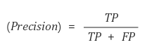
- Recall
  - 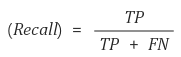
- Trade-off
  - Precision과 Recall은 Trade-OFF 관계
  - FN, FP의 Trade-OFF -> Precision과 Recall

### Accuracy and F1-Score

- Accuracy
  - 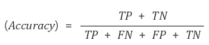

- F1-Score
  - F1 score는 Precision과 Recall의 조화평균
  - 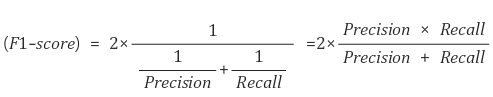
  - 조화평균 : 산술평균과 다르게 큰 비중이 끼치는 bias를 줄이는 방식
  - 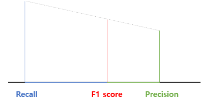

## 앙상블 학습(Ensemble Learning) : 부스팅(Boosting) VS 배깅(Bagging)

Click

### Bagging: Bootstrap Aggregation
- **parallel**
- 복원 추출 방식(Bootstrap)으로 데이터를 추출하여 모델을 학습
- 같은 과정을 여러번 반복하여 여러 개의 개별 학습 모델을 만듦
- 학습 시킨 모델에 테스트 데이터가 입력된다면, 각 모델별로 예측 값을 만들고 투표(분류)나 평균(회귀)로 최종 예측
- ex) 랜덤 포레스트
- 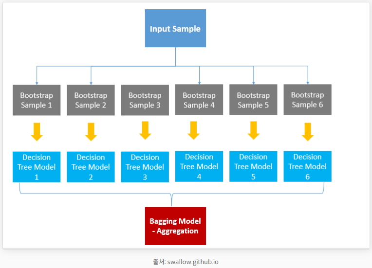

### Boosting
- **sequential**
- 처음 모델이 예측을 하면 그 결과에 따라 데이터에 가중치가 부여
- 부여된 가중치가 다음 모델에 영향
- 잘못 분류된 데이터에 집중하여 새로운 분류 규칙을 만드는 단계를 반복
- XGBoost, LightGBM
- 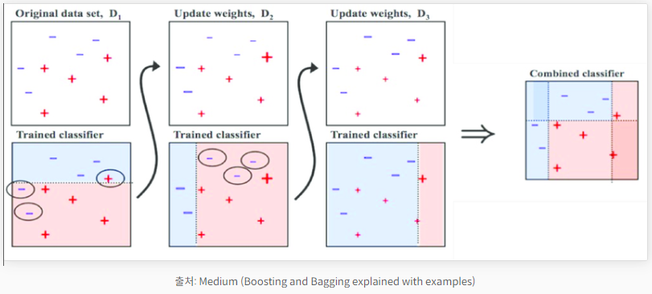

### 차이점
- **parallel** vs **sequential**
- 개별 결정 트리의 낮은 성능이 문제라면 부스팅이 적합, 오버 피팅이 문제라면 배깅이 적합

## 편향(Bias)과 분산(Variance) Trade-off

Click

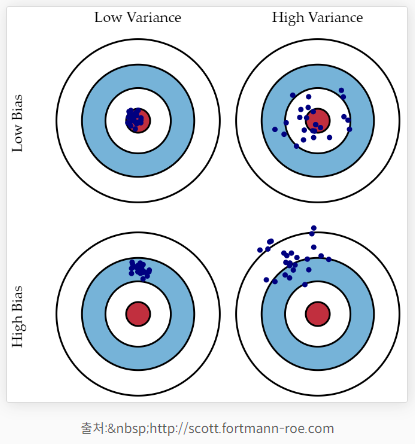

### 편향 : Bias

- 지나치게 단순한 모델로 인한 Error. 편향이 크면 Under-fitting
- 편향이 크다 -> 중요한 요소를 놓치고 있다

### 분산 : Variance

- 지나치게 복잡한 모델로 인한 Error. 분산이 크면 Over-fitting
- 분산이 크다 -> 지나치게 적합, 일반화가 되지 않은 모델

### 편향-분산 Trade-off

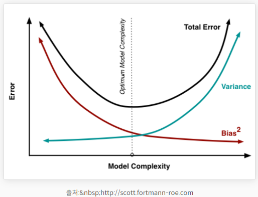

## 파라미터(Parameter)와 하이퍼 파라미터(Hyper Parameter)

Click

### 파라미터(Parameter)

    A model parameter is a configuration variable that is internal to the model and whose value can be estimated from data.

    - They are required by the model when making predictions.
    - They values define the skill of the model on your problem.
    - They are estimated or learned from data.
    - They are often not set manually by the practitioner.
    - They are often saved as part of the learned model.

- 모델 내부적으로 결정되는 값
- 사용자에 의해 조정되지 않는 값

### 하이퍼 파라미터(Hyper Parameter)

    A model hyperparameter is a configuration that is external to the model and whose value cannot be estimated from data.

    - They are often used in processes to help estimate model parameters.
    - They are often specified by the practitioner.
    - They can often be set using heuristics.
    - They are often tuned for a given predictive modeling problem.

- 모델 외부적으로 결정되는 값
- 사용자에 의해 조정되는 값, 직접 세팅

## 에이다 부스트 : AdaBoost

### AdaBoost 개요

## 지도 학습 VS 비지도 학습

- supervised Learning : labeled Data
- unsupervised Learning : not need labeled Data

## Machine Learning VS Deep Learning

- Machine Learning : Input -> Feature Extraction -> Classification -> Output
- Deep Learning : Input -> Feature Extraction + Classification -> Output

