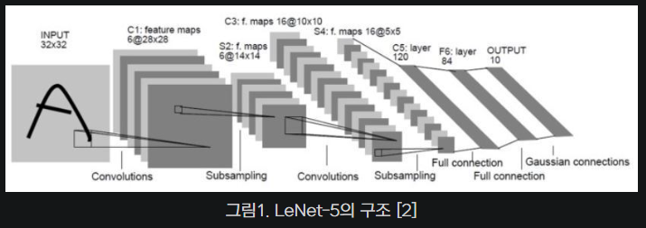

# Vision

## 2D Vision

Click

### Swin Transformer

- Swin Transformer: Hierarchical VIsion Transformer using Shifted Windows
  - Swin Transformer는 transformer 구조를 object detection에 적용한 모델
  - image를 어떻게 patch로 분할하느냐에 따라 다양한 variant가 존재 -> Resolution 차이
  - **Shifted Windows**를 사용하여 hierarchical transformer로 representation을 학습

### YOLO

- Bounding Box를 사용하지 않고 한번에 연산

### ResNet

- ResNet : Deep Residual Learning for Image Recognition
  - **Vanishing / Exploding gradient 현상** 을 해결
  - Residual Module -> F(x) + x

### VGG  

### AlexNet
 - "ImageNet Classification with Deep Convolutional Neural Networks", 2012
 - 2012년 ILSVRC 우승
 - 2개의  GPU로 병렬 연산 -> 병렬적인 구조로 설계
 - 

### LeNet

 - "Gradient-based learning applied to document recognition", 1998
 - CNN의 조상
 - 얀 르쿤(Yann Lecun)
 - Kernel, window size, padding, striding
 - 

### ref
 - [ref](https://bskyvision.com/421)

## 3D Vision

